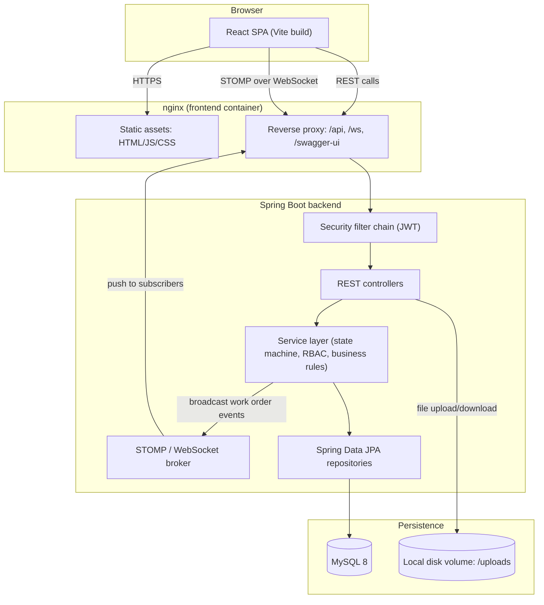
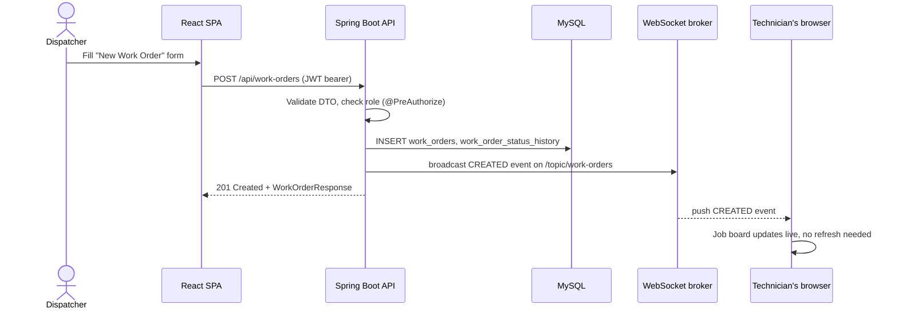
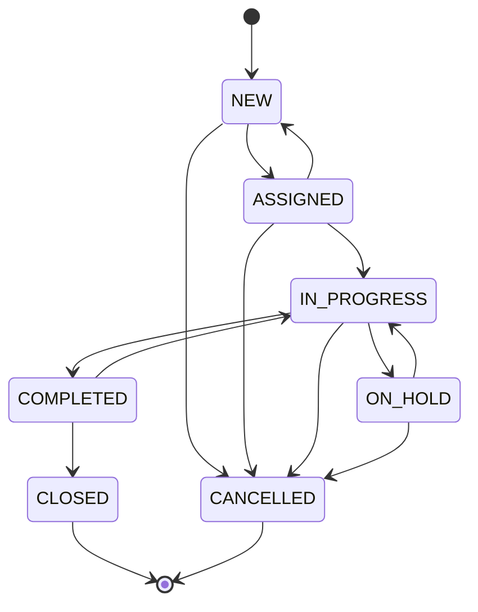
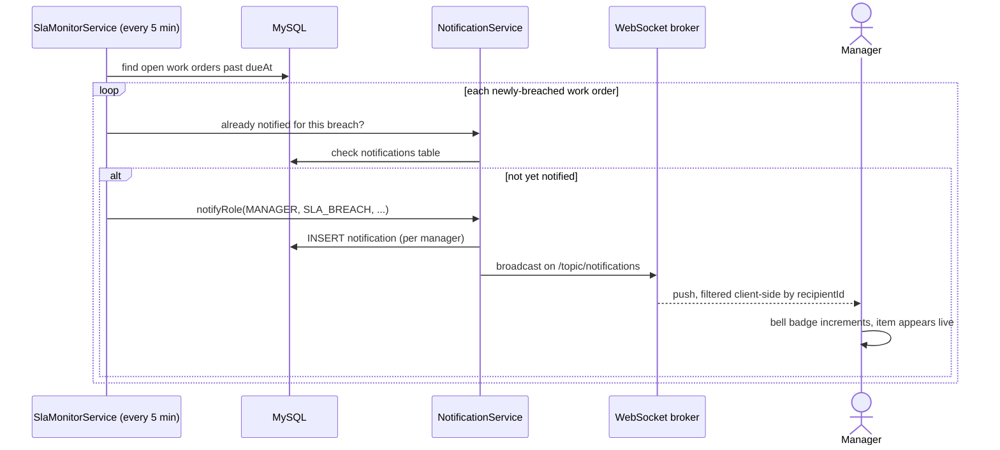
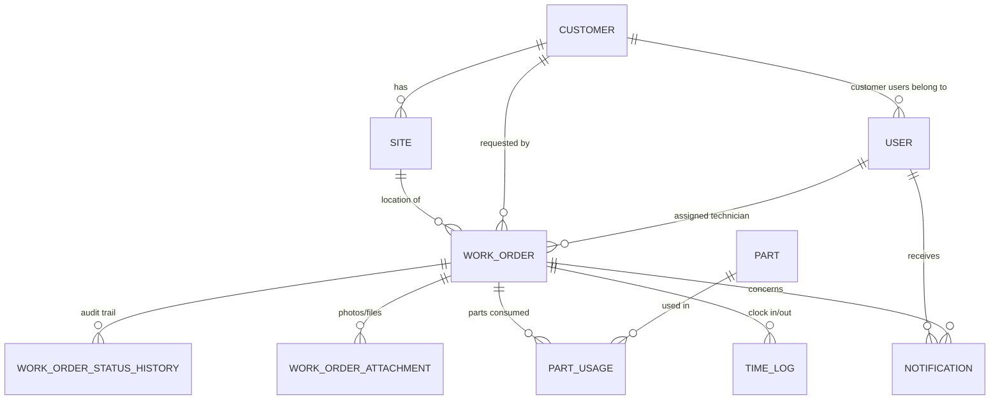

# Architecture — Project KEYSTONE

## System overview

## Request flow: creating and dispatching a work order

## Work order status state machine

Enforced server-side in `WorkOrderService` — the API rejects any transition not shown below
with HTTP 409, regardless of what the client requests.

## Request flow: SLA breach notification

## Data model (core entities)

## Why these choices

- **Server-enforced state machine** rather than trusting the client: a technician's app or a
  buggy frontend build can never corrupt a work order into an invalid status — the same
  `TRANSITIONS` map is the single source of truth for every entry point (REST, and in the
  future, any other integration).
- **STOMP/WebSocket over polling**: dispatch boards are inherently multi-user — a dispatcher
  assigning a job should be visible to the technician immediately. Polling every few seconds
  wastes requests and still has visible lag; a broadcast on state change is both cheaper and
  faster.
- **Local disk for attachments, behind an interface (`FileStorageService`)**: keeps the Docker
  Compose stack dependency-free for local dev/grading, while the storage logic is isolated
  behind one class — swapping to S3/GCS later touches only that file.
- **Testcontainers for integration tests**: H2 is fast for pure unit/service-layer tests, but it
  is not MySQL — subtle SQL dialect differences (and Flyway migrations meant for MySQL) are only
  actually verified by testing against a real MySQL 8 container.
